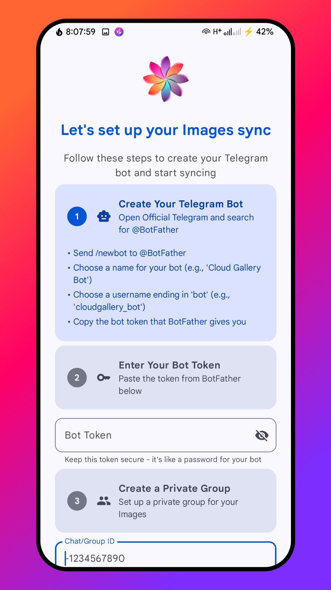
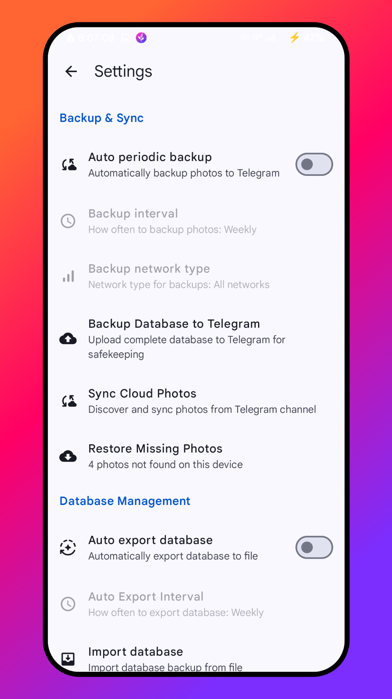

<!-- ---------- Header ---------- -->

  
  <h1>Chitralaya CloudGallery</h1>
  <h4><em>"Chitralaya" ((चित्रालय)) = "House of Images" in Sanskrit</em></h4>
  <h3>🚀 Your Personal Photo Vault with Unlimited Cloud Storage</h3>
  
<strong>Transform Telegram into your private, unlimited photo backup solution!</strong>

  
🔒 <em>100% Private • No Telemetry • Your Data, Your Control</em>

<!-- ---------- Badges ---------- -->
  

    
    
    
    
    
     

<!-- ----------   Labels ---------- -->

  
  
  
  

---

## 🌟 **What is CloudGallery?**

Transform Telegram into your personal, unlimited photo cloud storage. Chitralaya CloudGallery is the revolutionary backup app that gives you secure, and truly private unlimited cloud storage. Unleash your photos and save your memories without limits!

### 💡 **How It Works**
1. **🤖 Create a Telegram Bot** (2 minutes setup)
2. **📱 Connect CloudGallery** to your bot
3. **☁️ Enjoy Unlimited Backup** - Free forever!

---

## 🔐 **Privacy & Security First**

### ❌ **What We DON'T Do**
- No telemetry or tracking
- No analytics or data mining
- No third-party services
- No ads or monetization

### ✅ **What We DO**
- **Direct device ↔ Telegram communication only**
- **You own and control your bot**
- **Fully open source and auditable**
- **Complete data privacy guaranteed**

---
### 🛡️ ** Privacy & Security **

| **Security Assessment** | **Audit Findings** |
|-------------------------|---------------------|
| **EXCELLENT PRIVACY IMPLEMENTATION** | • Only Telegram API: All network traffic goes exclusively to Telegram Bot API • No Third-Party Services: Zero analytics, telemetry, or tracking endpoints • No Hidden Endpoints: no undisclosed network calls |
| **VERIFIED CLEAN DEPENDENCIES** | • No Analytics Libraries: No Firebase, Google Analytics, Crashlytics, or similar • Minimal Dependencies: Only essential libraries (Compose, Room, Retrofit, Telegram Bot) • No Tracking SDKs: Explicitly excludes LeakCanary and other potential tracking tools |
| **STRONG ENCRYPTION IMPLEMENTATION** | • AES-256 Encryption: Bot tokens and chat IDs stored with AndroidX Security Crypto • Proper Key Management: Uses Android Keystore with AES256_GCM encryption |
| **APPROPRIATE PERMISSION USAGE** | • READ_IMAGES: Used exclusively for reading IMAGES as stated • INTERNET: Only for Telegram API communication • FOREGROUND_SERVICE: For background IMAGES monitoring • No Excessive Permissions: No location, camera, contacts, or other sensitive permissions |
| **CLEAN DEPENDENCY PROFILE** | • Reputable Libraries: All dependencies from trusted sources (Google, Square, JetBrains) • No Suspicious Libraries: No unknown or potentially malicious dependencies • Open Source: Telegram bot library is open source and auditable |
| **TRANSPARENT BACKGROUND OPERATIONS** | • IMAGES Monitoring: Only monitors IMAGES changes for sync purposes • No Unauthorized Operations: All background tasks clearly related to IMAGES sync functionality • Proper Service Implementation: Uses foreground services with user-visible notifications |
| **NO HIDDEN FUNCTIONALITY** | • ProGuard Rules: Standard obfuscation for release builds, no suspicious exclusions • Open Source: All functionality is visible and auditable |

---

## ✨ **Key Features**

- 📸 **Unlimited Cloud Backup** - Free storage via Telegram
- 🔒 **100% Private** - No telemetry, analytics, or third parties
- 🎨 **Beautiful Material Design 3** - Modern, adaptive interface
- 🖼️ **Customizable Photo Grid** - 3-6 columns with rounded corners
- 🔄 **Smart Sync** - Automatic backup with change detection
- 📱 **Cross-Device Restore** - Access photos anywhere
- 🛠️ **Advanced Bot API** - 

---

## 📥 **Get CloudGallery**

  
   
  
<strong>🆓 Free Forever • 🔓 Open Source • 🚀 Ready to Use</strong>

---

## 🚀 **Quick Setup**

### 🤖 **Step 1: Create Telegram Bot**
1. Open Telegram → Search `@BotFather`
2. Send `/newbot` → Follow prompts
3. Copy your bot token 🔑
4. Create private group → Add bot → Type `/start` → Get chat ID

### 📱 **Step 2: Connect App**
1. Download CloudGallery from GitHub
2. Enter bot token and chat ID
3. Start backing up! 🎉

---

## 📱 **Screenshots**

  
  
  

  
  
  

---

## 🤝 **Community**

- 🐛 **Bug reports:** [GitHub Issues](https://github.com/AKS-Labs/CloudGallery/issues)
- 💡 **Feature requests:** [GitHub Issues](https://github.com/AKS-Labs/CloudGallery/issues)
- 👨‍💻 **Contribute:** Fork and submit pull requests
- ⭐ **Show support:** Star the repository!

---

## 🙏 **Credits**

## Credits
* [Whitehole Project](https://github.com/beradeep/whitehole/) for the base code.
* [kotlin-telegram-bot](https://github.com/kotlin-telegram-bot) for the Telegram bot library.
* [Material Icons](https://material.io/resources/icons/) for the icons.

---

  <h3>🔒 **Your Photos. Your Privacy. Your Control.** 🔒</h3>
  
<strong>Experience unlimited photo backup without compromising your privacy!</strong>

  <a href="https://github.com/AKS-Labs/CloudGallery/releases">
    <strong>📥 Download CloudGallery Today!</strong>
  </a>

