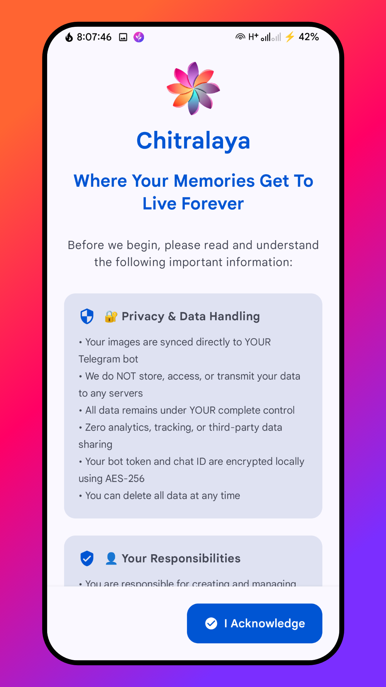
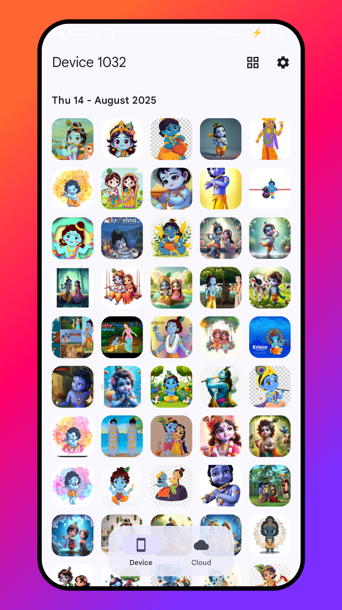
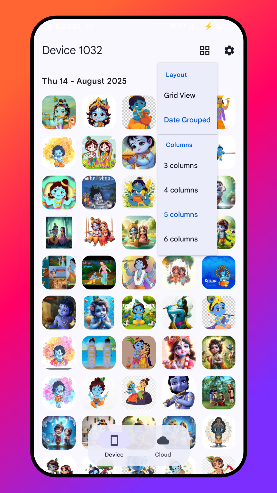
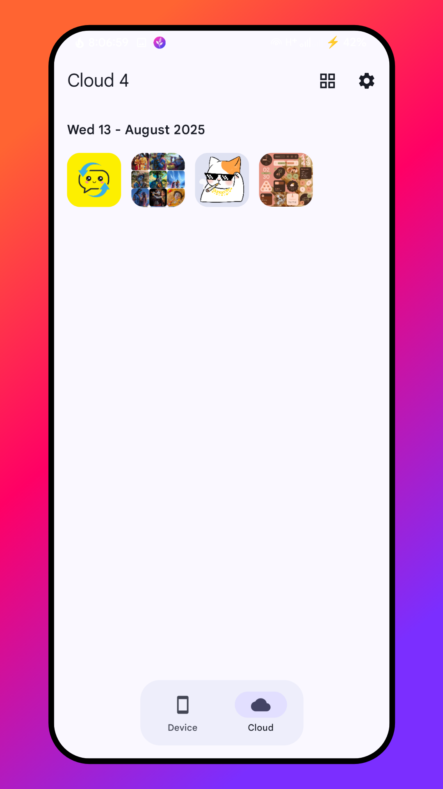

<!-- ---------- Header ---------- -->

  
  <h1>Chitralaya CloudGallery</h1>
  <h4><em>"Chitralaya" ((चित्रालय)) = "House of Images" in Sanskrit</em></h4>
  <h3>🚀 Your Personal Photo Vault with Unlimited Cloud Storage</h3>
  
<strong>Transform Telegram into your private, unlimited photo backup solution!</strong>

  
🔒 <em>100% Private • No Telemetry • Your Data, Your Control</em>

<!-- ---------- Badges ---------- -->
  

    
    
    
    
    
     

<!-- ----------   Labels ---------- -->

  
  
  
  

---

## 🌟 What is CloudGallery?

**Chitralaya CloudGallery** is a simple open-source Android app  
that turns your Telegram account into a private photo cloud storage — no signup, no servers, no tracking.  

Your photos go straight from your phone to your own Telegram chat,  
giving you free, practically unlimited backup space with full control over your data.

It’s not a company or a service — just a open-source tool made by a privacy-minded developer who believes your memories should stay *yours*.

---

## 👋 Hey there!

I’m **Aditya**, the guy behind **AKS-Labs**.  

Before you scroll, let me make one thing clear —  

I’m just another user like you, tired of the usual *“cloud storage deal”* — free at first,  
then you pay with your money... or even worse, with your privacy.  

So I built something different — **Chitralaya CloudGallery**. 

* It’s not a company, not a service.  
* Just a simple, open-source tool —  

a bridge between your Android phone 📱 and your Telegram account 📡.  

---

## 🤔 Why even build this?

I was using Google Photos like everyone else. Free storage, nice features, AI magic… but then I realized:

* Google scans my photos to “offer me memories” → which also means they *read* them.
* Google uses user data to personalize services, show relevant ads, improve products,services.
* We users don’t even know or read what other privacy-concerning terms we’ve agreed to at the time of sign-up.
* And will they only use data collected from Google Photos to improve Google Photos — or does it include all Google products?
* Sharing a link doesn’t mean it’s private — anyone with that link can see your photos.
* Needs to compress images when free storage is full.
* One day, “free storage is full” and they said: “Pay up for more storage.”

Google, builds entire business models around data.  

That’s when it hit me: my photos aren’t *mine*.

I wanted something unlimited, private, and mine.
And then I looked at Telegram.

---

## But wait… Why Telegram📡? Can’t Telegram see my photos?

This is the elephant in the room 🐘.  
“Aditya, you’re asking me to upload my private photos to Telegram. Should I trust them?” 

**Here’s my honest take:**  

Telegram encrypts your data in transit, but not end-to-end (like Signal).  
So if they *really* wanted to, **they could peek.**  

***But let’s be honest — so can Google, iCloud, OneDrive, or any cloud you don’t run yourself.***  

The only way to have *absolute* control? Run your own server.  
But not everyone can afford or maintain that.  

**But here’s the thing:**  

* Telegram gives insane free cloud storage.  
* No limits (beyond what you can practically upload).  
* No compression if you upload as files.  
* And their infra is stable enough to trust for years.  

So it boils down to: who do *you* want to trust more?  
For me, Telegram felt like the lesser **evil.**  

But again — it’s your **choice.** I’m not telling you to trust Telegram.  
I’m just saying: *here’s another option, do with it what you like.*  
And if you want to dive deeper, check out the **[FAQ section](https://github.com/AKS-Labs/CloudGallery/blob/main/FAQ.md )** where I go through all these questions in detail.  
 
**So my thought was simple:**  
👉 If I’m anyway trusting a company, I’d rather trust Telegram (with unlimited space, no ads, no AI snooping)  
than Google(Google, which builds entire business models around data.).

***Still, it’s your call. I’m not here to sell you Telegram. I’m just here to hand you the option.***

---

## 🛡️ Transparency First

I don’t want you to blindly trust me either. Here’s how CloudGallery works:

* Your bot token & chat ID are **stored securely in Android keystore** (AES encryption).
* Your photos go **directly to your Telegram account** — no middle servers.
* I don’t track you, I don’t log you, I don’t even know who uses this app.
* The app is **open source**. You can read the code yourself.

Now, let me be fully transparent about limitations too:

* Bot API has quirks → it can’t read your old messages without chat IDs.
* That means if you reinstall the app fresh, you won’t automatically see your past uploads.
* To fix that, CloudGallery keeps a **local JSON database** of synced images.
* This JSON file is also backed up to your Telegram so you can re-import it on another phone.

But warning ⚠️: This database is plain text (readable JSON), not encrypted. If you leak it, others can read metadata. Keep it safe. That’s your responsibility.

⚠️ **Important:** The database only stores **metadata and image IDs** — it does **not** contain the actual images.  

Can someone access your images with just the IDs? **No**, they would also need your bot token and chat ID.  

I’m being this honest because I believe trust starts with showing *both* the strengths and the flaws.

### Other flaws  

* The app is focused on private backup and browsing, so it **does not have advanced cloud features** like folder hierarchy, sharing links, or multi-user support.  

* No in-app end-to-end encryption yet — images are uploaded as-is to Telegram.  

* no batch editing or deletion.  

* Only available on Android; you can still access your images by login in to Telegram Account on other devices.  

* UI/UX is functional but not as polished or feature-rich as Google Photos, iCloud, or other commercial cloud apps.  

---

In short: CloudGallery is a **privacy-first, direct backup tool** to Telegram.  

It’s **not a full-featured cloud platform yet**, but it gives you **control over your photos** and the ability to **build on it with community support**.

---

## ✨ What can it do today?

* 📸 Unlimited photo backup → via your Telegram bot  
* 🔄 Smart sync → detects changes automatically  
* 🎨 Modern Material 3 UI → clean, minimal, simple  
* 📱 Database import/export → restore your photo history across devices  
* 🖼️ Browse synced photos in a proper gallery (not Telegram’s clunky file view)  
* 🔒 Strong key storage for tokens  

---

## 🔮 What can it do tomorrow?

Here’s where you come in. CloudGallery is community-powered. With your support, I want to add:

* 🔐 **On-device encryption layer** → so even Telegram can’t peek into your files
* 📝 OCR search → find photos by text inside them
* 📤 Batch upload & delete
* 🤖 Multiple bot support
* 📂 Folder-specific uploads
* ✨ Even smoother Material 3 experience
* 💡 And honestly… whatever *you* suggest in the Telegram group

These aren’t “marketing slides”. They’re real ideas sitting in my notes, waiting for time and support.

---

## ❤️ Final Words

I’m not a company. I’m not trying to “capture market share.”
I’m just one developer building something I wanted for myself — and thought others might find useful.

If you like CloudGallery and want to see it grow:

* ⭐ Star the repo
* 💬 Join the [AKS-Labs Telegram group](https://t.me/AKSLabs)
* ☕ Maybe donate, if you can.

At the end of the day, this is about choice.
If you don’t like it, you lose nothing.
If you do, you gain control over your memories.

Your photos, your choice.

---

## 📥 **Get CloudGallery**

  
   
  
<strong>🆓 Free Forever • 🔓 Open Source • 🚀 Ready to Use</strong>

---

## 🚀 **Quick Setup**

### 🤖 **Step 1: Create Telegram Bot**
1. Open Telegram → Search `@BotFather`
2. Send `/newbot` → Follow prompts
3. Copy your bot token 🔑
4. Create private group → Add bot → Type `/start` → Get chat ID

### 📱 **Step 2: Connect App**
1. Download CloudGallery from GitHub
2. Enter bot token and chat ID
3. Start backing up! 🎉

---

## 📱 **Screenshots**

  
  
  

  
  
  

---

## 🤝 **Community**

- 🐛 **Bug reports:** [GitHub Issues](https://github.com/AKS-Labs/CloudGallery/issues)
- 💡 **Feature requests:** [GitHub Issues](https://github.com/AKS-Labs/CloudGallery/issues)
- 👨‍💻 **Contribute:** Fork and submit pull requests
- ⭐ **Show support:** Star the repository!

---

## 🙏 **Credits**

## Credits
* [Whitehole Project](https://github.com/beradeep/whitehole/) for the base code.
* [kotlin-telegram-bot](https://github.com/kotlin-telegram-bot) for the Telegram bot library.
* [Material Icons](https://material.io/resources/icons/) for the icons.

---

  <h3>🔒 **Your Photos. Your Privacy. Your Control.** 🔒</h3>
  
<strong>Experience unlimited photo backup without compromising your privacy!</strong>

  <a href="https://github.com/AKS-Labs/CloudGallery/releases">
    <strong>📥 Download CloudGallery Today!</strong>
  </a>

